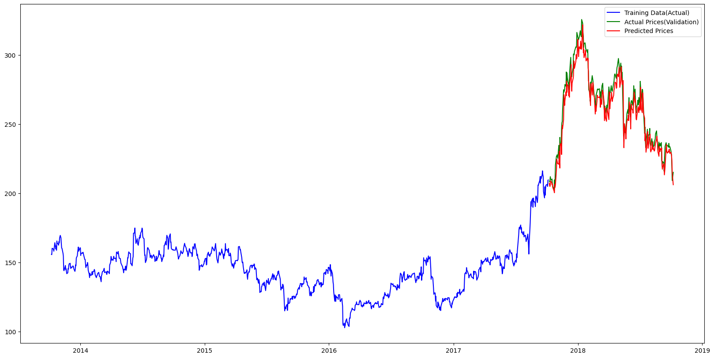

# 📈 Stock Price Prediction using LSTM (NSE - Tata Global Beverages)

This project implements a stock price prediction model using an LSTM (Long Short-Term Memory) neural network in **Google Colab**. It predicts the future closing prices of Tata Global Beverages Limited based on historical stock data.

---

## 🔧 Technologies Used

- **Python** (Google Colab Environment)
- **Pandas** – for data loading and manipulation
- **NumPy** – for numerical operations
- **Matplotlib** – for plotting stock trends and predictions
- **Keras** (with TensorFlow backend) – for building and training the LSTM model

---

## 📁 Dataset

- **Name**: `NSE-Tata-Global-Beverages-Limited.csv`
- **Source**: Kaggle
- **Contents**: Daily OHLC (Open, High, Low, Close) stock data

| Column        | Description                 |
|---------------|-----------------------------|
| Date          | Date of the record          |
| Open          | Opening price               |
| High          | Highest price during the day|
| Low           | Lowest price during the day |
| Last          | Last traded price           |
| Close         | Closing price               |
| Total Trade Quantity | Number of shares traded |
| Turnover (Lacs) | Turnover in lakhs          |

---

## 🔍 Objective

To predict the **closing stock price** using an LSTM-based deep learning model trained on historical stock data.

---

## 🚀 How to Run

1. Open the project in **Google Colab**.
2. Upload the dataset `NSE-Tata-Global-Beverages-Limited.csv`.
3. Run all cells in sequence:
   - Data loading and preprocessing
   - Normalization using `MinMaxScaler`
   - Model creation using LSTM
   - Training and testing the model
   - Plotting predictions

---

## 🧠 Model Summary

- LSTM model with:
  - Input layer shaped to historical time steps (e.g., 60-day windows)
  - One or more LSTM layers
  - Dense layer for output
- Optimizer: Adam
- Loss: Mean Squared Error (MSE)
